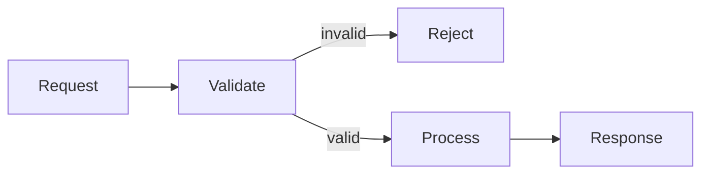

# Render Readable Diagrams

What: When a response benefits from showing a flow, sequence, state transition, dependency, hierarchy, or other structure, express it with a structured diagram that renders reliably in common Markdown clients. Prefer Mermaid or another readable, fast-rendering diagram format.

Why: Structured diagrams preserve relationships as data: people can follow them visually, and AI systems can parse their nodes and edges. ASCII art depends on spacing and monospaced layout, which can shift across clients and leaves the intended relationships ambiguous.

How: Choose the smallest diagram type that matches the structure: flowcharts for decisions and processes, sequence diagrams for interactions over time, state diagrams for lifecycle changes, and class or entity diagrams for relationships. Put Mermaid diagrams in a fenced `mermaid` code block. Give nodes explicit labels, make edge direction meaningful, and label non-obvious relationships. Use a list or table when the content does not have a meaningful structure to visualize. Treat ASCII art as unavailable for diagram output; replace it with Mermaid, a table, or a list.

Example:

